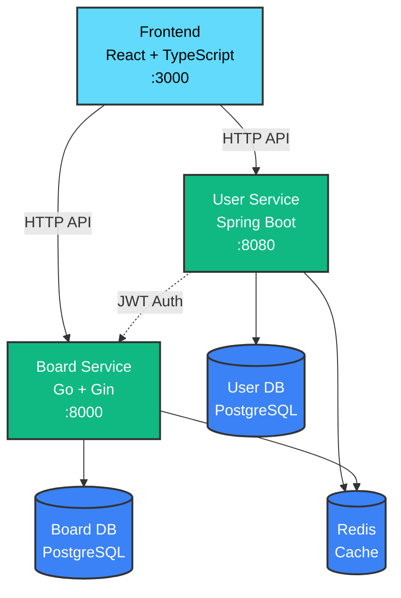

# weAlist - Project Management Platform

마이크로서비스 기반 프로젝트 관리 플랫폼

**Tech Stack**: Spring Boot (Java 21), Go 1.21+/Gin, PostgreSQL 17, Redis 7, Docker Compose
**Infrastructure**: AWS (Terraform), EC2, RDS, ElastiCache, ALB, Route53

## 🏗️ 인프라 아키텍처
### AWS Infrastructure Overview
본 프로젝트의 AWS 인프라는 Terraform으로 관리되며, 별도 리포지토리에서 Infrastructure as Code로 관리됩니다.

**🔗 Infrastructure Repository**: [wealist-terraform-prod](https://github.com/OrangesCloud/wealist-terraform-prod.git)
**📋 상세 아키텍처 문서**: [ARCHITECTURE.md](https://github.com/OrangesCloud/wealist-terraform-prod/blob/main/ARCHITECTURE.md)


### Infrastructure 특징
- Infrastructure as Code: Terraform을 통한 완전한 인프라 코드화
- High Availability: Multi-AZ RDS, Auto Scaling Group을 통한 고가용성
- Security: VPC, Security Groups, IAM을 통한 보안 강화
- Monitoring: CloudWatch, Application Load Balancer Health Check
- SSL/TLS: ACM을 통한 인증서 자동 관리
- CDN: CloudFront를 통한 글로벌 콘텐츠 배포

## 🏗️ 서비스 구조

| 서비스               | 기술 스택               | 포트   | 설명                                      |
|-------------------|---------------------|------|-----------------------------------------|
| **Frontend**      | React               | 3000 | 사용자 인터페이스, 대시보드, 프로젝트 관리 UI             |
| **User Service**  | Spring Boot (Java 21) | 8080 | 사용자 인증, 워크스페이스 관리, OAuth2               |
| **Board Service** | Go/Gin              | 8000 | 프로젝트/보드 관리, 커스텀 필드, Fractional Indexing |

## 🚀 주요 기능
### Frontend 기능
- ✅ 반응형 웹 디자인 (Tailwind CSS)
- ✅ 실시간 프로젝트 대시보드
- ✅ 드래그 앤 드롭 칸반 보드
- ✅ Google OAuth 소셜 로그인
- ✅ 워크스페이스 관리 인터페이스
- ✅ 역할 기반 UI 권한 제어
- ✅ 반응형 모바일 지원

### Backend 기능
- ✅ 워크스페이스 & 프로젝트 관리
- ✅ 역할 기반 접근 제어 (OWNER/ADMIN/MEMBER)
- ✅ JWT 기반 인증 (HS512)
- ✅ Redis 캐싱 전략
- ✅ RESTful API with Swagger
- ✅ GitHub Actions CI/CD (EC2 자동 배포)
- ✅ Prometheus + Grafana 모니터링

## 📋 빠른 시작

### 1. 환경 변수 설정

```bash
# 개발 환경 설정 파일 생성
cp docker/env/.env.example docker/env/.env.dev

# .env.dev 파일을 열어 필요한 값 수정
# - GOOGLE_CLIENT_ID
# - GOOGLE_CLIENT_SECRET
# - JWT_SECRET (64+ bytes)
```

### 2. Docker 환경 실행

**로컬 개발 환경**:
```bash
./docker/scripts/dev.sh up          # 서비스 시작
./docker/scripts/dev.sh logs        # 로그 확인
./docker/scripts/dev.sh down        # 서비스 중지
./docker/scripts/dev.sh clean       # 완전 초기화
```

**EC2 Dev 환경**:
```bash
./docker/scripts/ec2-dev.sh setup   # 초기 설정
./docker/scripts/ec2-dev.sh up      # 서비스 시작
./docker/scripts/ec2-dev.sh health  # 헬스 체크
```

**모니터링 스택**:
```bash
./docker/scripts/monitoring.sh up   # Prometheus + Grafana 시작
```

### 3. 서비스 확인

**개발 환경 접속**:
- Frontend: http://localhost:3000
- User Service API: http://localhost:8080
- User Service Swagger: http://localhost:8080/swagger-ui/index.html
- Board Service API: http://localhost:8000
- Board Service Swagger: http://localhost:8000/swagger/index.html
- Grafana: http://localhost:3001 (admin / GRAFANA_ADMIN_PASSWORD)
- Prometheus: http://localhost:9090

**헬스 체크**:
```bash
curl http://localhost:8080/health   # User Service
curl http://localhost:8000/health   # Board Service
```

## 🛠️ 개발 명령어

### User Service (Spring Boot)
```bash
cd user-service
./gradlew clean build              # 빌드 & 테스트
./gradlew bootRun                  # 로컬 실행 (port 8080)
```

### Board Service (Go)
```bash
cd board-service
go run cmd/api/main.go             # 로컬 실행
go test -v -race -cover ./...      # 테스트
swag init -g cmd/api/main.go -o docs  # Swagger 재생성
./scripts/db/apply_migrations.sh dev  # DB 마이그레이션
```

## 📦 기술 스택
**Frontend**
- Core: react

**Backend**:
- User Service: Spring Boot 3.x, Java 21, Spring Security
- Board Service: Go 1.21+, Gin, GORM, Clean Architecture

**Infrastructure**:
- Database: PostgreSQL 17 (각 서비스별 독립 DB)
- Cache: Redis 7
- Container: Docker Compose
- CI/CD: GitHub Actions
- Cloud: AWS (EC2, ECR, ALB, CodeDeploy)
- Monitoring: Prometheus, Grafana, Loki

## 🏗️ 아키텍처

### 마이크로서비스 구조



**핵심 설계 원칙**:
- **서비스 독립성**: 각 서비스는 독립적인 데이터베이스 사용
- **No Foreign Keys**: 샤딩 대비, 애플리케이션 레벨 관계 관리
- **JWT 인증**: User/Board 서비스 간 공유 SECRET_KEY
- **Clean Architecture**: Board Service는 DDD 패턴 적용

## 🔄 CI/CD Pipeline

### Development
```
Code Push → GitHub
    ↓
CI (ECR): Build & Test
    ↓
CD (SSH): Deploy to EC2 Dev
    ↓
Health Check → Success
```

### Production
```
Code Push → GitHub
    ↓
CI (ECR): Build & Test
    ↓
CD (CodeDeploy): Deploy to EC2 Prod
    ↓
Health Check → Success/Rollback
```

**Frontend 전용 워크플로우**:
- 빌드: Vite를 통한 최적화된 번들링
- 테스트: TypeScript 타입 검사 + ESLint
- 배포: Nginx를 통한 정적 파일 서빙

**워크플로우 위치**: `.github/workflows/`
- CI: `ci-{env}-{service}.yml`
- CD: `cd-{env}-{service}.yml`

자세한 내용은 **[.github/workflows/README.md](./.github/workflows/README.md)** 참조

## 📚 문서

### 개발 가이드

### 서비스별 문서
- **Frontend**

- **User Service**:

- **Board Service**:

### 배포 & 운영


## 📂 프로젝트 구조

```
wealist-project/
├── front/                 # frontend (react)
├── user-service/          # User Service (Spring Boot)
├── board-service/         # Board Service (Go)
├── docker/               # Docker 환경 설정
│   ├── compose/         # Docker Compose 파일
│   ├── env/            # 환경 변수
│   └── scripts/        # 헬퍼 스크립트
├── prometheus/          # Prometheus 설정
├── loki/               # Loki 설정
├── .github/workflows/  # CI/CD 워크플로우
├── k6-test/          # 부하테스트 파일
└── README.md         # 이 파일
```
