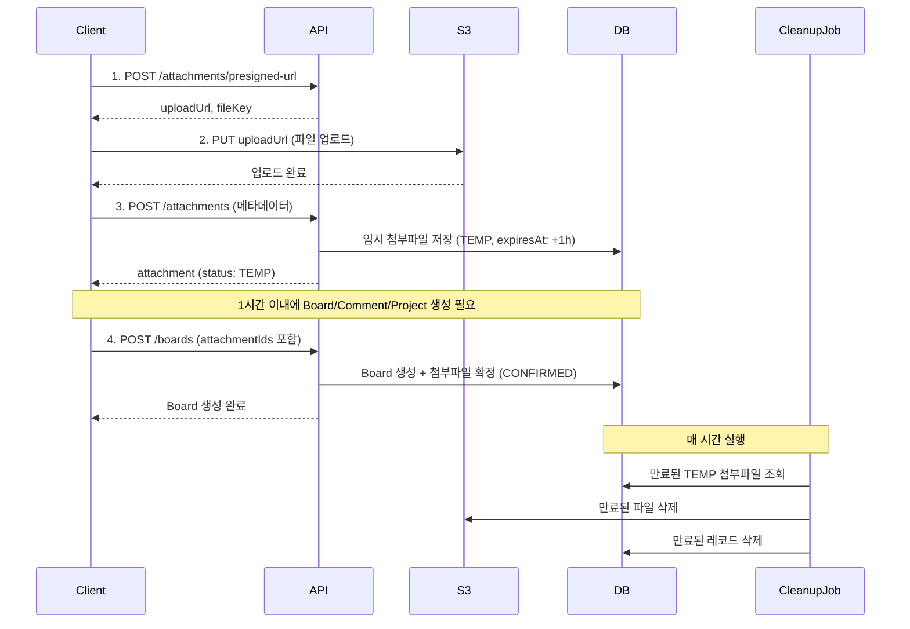

# Presigned URL 기반 파일 업로드 API 가이드

## 개요

이 문서는 board-service의 Presigned URL 기반 파일 업로드 API 사용 방법을 설명합니다.

Presigned URL 방식을 사용하면 클라이언트가 백엔드 서버를 거치지 않고 S3에 직접 파일을 업로드할 수 있어, 서버 부하를 줄이고 업로드 속도를 향상시킬 수 있습니다.

## 지원 파일 형식

### 이미지
- jpg, jpeg, png, gif, webp

### 문서
- pdf, txt, doc, docx, xls, xlsx, ppt, pptx

### 제한사항
- 최대 파일 크기: **20MB**
- 음성/영상 파일은 지원하지 않음 (mp3, wav, mp4, avi, mov 등)

## API 엔드포인트

### 1. Presigned URL 생성

**Endpoint:** `POST /api/attachments/presigned-url`

**설명:** S3에 직접 업로드할 수 있는 Presigned URL을 생성합니다.

**Request Body:**
```json
{
  "entityType": "BOARD",
  "workspaceId": "abc123",
  "fileName": "image.jpg",
  "fileSize": 1024000,
  "contentType": "image/jpeg"
}
```

**Request Fields:**
- `entityType` (required): 파일이 속할 엔티티 타입 (`BOARD`, `COMMENT`, `PROJECT`)
- `workspaceId` (required): 워크스페이스 ID
- `fileName` (required): 업로드할 파일 이름
- `fileSize` (required): 파일 크기 (bytes)
- `contentType` (required): 파일의 MIME 타입

**Response (200 OK):**
```json
{
  "requestId": "550e8400-e29b-41d4-a716-446655440000",
  "data": {
    "uploadUrl": "https://wealist-dev-files.s3.ap-northeast-2.amazonaws.com/board/boards/abc123/2024/01/550e8400-e29b-41d4-a716-446655440000_1704067200.jpg?X-Amz-Algorithm=...",
    "fileKey": "board/boards/abc123/2024/01/550e8400-e29b-41d4-a716-446655440000_1704067200.jpg",
    "expiresIn": 300
  }
}
```

**Response Fields:**
- `uploadUrl`: S3 업로드를 위한 Presigned URL (5분간 유효)
- `fileKey`: S3에 저장될 파일의 키 (메타데이터 저장 시 사용)
- `expiresIn`: URL 만료 시간 (초)

**Error Responses:**
- `400 Bad Request`: 잘못된 요청 또는 파일 검증 실패
  ```json
  {
    "requestId": "...",
    "error": {
      "code": "FILE_TOO_LARGE",
      "message": "File size exceeds 20MB limit"
    }
  }
  ```
- `500 Internal Server Error`: Presigned URL 생성 실패

### 2. S3에 파일 업로드

**Endpoint:** `PUT {uploadUrl}`

**설명:** 1단계에서 받은 Presigned URL을 사용하여 S3에 직접 파일을 업로드합니다.

**Headers:**
```
Content-Type: {contentType}
```

**Body:** 파일의 바이너리 데이터

**Example (JavaScript):**
```javascript
const file = document.getElementById('fileInput').files[0];

const response = await fetch(uploadUrl, {
  method: 'PUT',
  headers: {
    'Content-Type': file.type
  },
  body: file
});

if (response.ok) {
  console.log('Upload successful');
}
```

**Example (cURL):**
```bash
curl -X PUT \
  -H "Content-Type: image/jpeg" \
  --data-binary @image.jpg \
  "{uploadUrl}"
```

### 3. 첨부파일 메타데이터 저장

**Endpoint:** `POST /api/attachments`

**설명:** S3 업로드 완료 후, 첨부파일 메타데이터를 데이터베이스에 저장합니다.

**Headers:**
```
Authorization: Bearer {access_token}
Content-Type: application/json
```

**Request Body:**
```json
{
  "entityType": "BOARD",
  "fileKey": "board/boards/abc123/2024/01/550e8400-e29b-41d4-a716-446655440000_1704067200.jpg",
  "fileName": "image.jpg",
  "fileSize": 1024000,
  "contentType": "image/jpeg"
}
```

**Request Fields:**
- `entityType` (required): 엔티티 타입 (`BOARD`, `COMMENT`, `PROJECT`)
- `fileKey` (required): 1단계에서 받은 파일 키
- `fileName` (required): 파일 이름
- `fileSize` (required): 파일 크기 (bytes)
- `contentType` (required): 파일의 MIME 타입

**Response (201 Created):**
```json
{
  "requestId": "...",
  "data": {
    "id": "attachment-uuid",
    "entityType": "BOARD",
    "entityId": null,
    "status": "TEMP",
    "fileName": "image.jpg",
    "fileUrl": "https://wealist-dev-files.s3.ap-northeast-2.amazonaws.com/board/boards/abc123/2024/01/550e8400-e29b-41d4-a716-446655440000_1704067200.jpg",
    "fileSize": 1024000,
    "contentType": "image/jpeg",
    "uploadedBy": "user-uuid",
    "uploadedAt": "2024-01-15T10:30:00Z",
    "expiresAt": "2024-01-15T11:30:00Z"
  }
}
```

**Response Fields:**
- `id`: 첨부파일 ID
- `entityType`: 엔티티 타입
- `entityId`: 연결된 엔티티 ID (임시 상태에서는 null)
- `status`: 첨부파일 상태 (`TEMP` 또는 `CONFIRMED`)
- `fileName`: 파일 이름
- `fileUrl`: S3 파일 URL
- `fileSize`: 파일 크기
- `contentType`: MIME 타입
- `uploadedBy`: 업로드한 사용자 ID
- `uploadedAt`: 업로드 시간
- `expiresAt`: 만료 시간 (임시 파일의 경우 1시간 후)

**Error Responses:**
- `400 Bad Request`: 잘못된 요청 또는 파일 검증 실패
- `401 Unauthorized`: 인증되지 않은 사용자
- `500 Internal Server Error`: 메타데이터 저장 실패

## 전체 업로드 플로우

### 1. Board 생성 시 첨부파일 포함

```javascript
// Step 1: Presigned URL 요청
const presignedResponse = await fetch('/api/attachments/presigned-url', {
  method: 'POST',
  headers: {
    'Content-Type': 'application/json'
  },
  body: JSON.stringify({
    entityType: 'BOARD',
    workspaceId: 'abc123',
    fileName: 'image.jpg',
    fileSize: file.size,
    contentType: file.type
  })
});

const { uploadUrl, fileKey } = (await presignedResponse.json()).data;

// Step 2: S3에 직접 업로드
await fetch(uploadUrl, {
  method: 'PUT',
  headers: {
    'Content-Type': file.type
  },
  body: file
});

// Step 3: 메타데이터 저장
const metadataResponse = await fetch('/api/attachments', {
  method: 'POST',
  headers: {
    'Authorization': `Bearer ${accessToken}`,
    'Content-Type': 'application/json'
  },
  body: JSON.stringify({
    entityType: 'BOARD',
    fileKey: fileKey,
    fileName: 'image.jpg',
    fileSize: file.size,
    contentType: file.type
  })
});

const attachment = (await metadataResponse.json()).data;

// Step 4: Board 생성 시 attachmentIds 포함
const boardResponse = await fetch('/api/boards', {
  method: 'POST',
  headers: {
    'Authorization': `Bearer ${accessToken}`,
    'Content-Type': 'application/json'
  },
  body: JSON.stringify({
    projectId: 'project-uuid',
    title: 'Board Title',
    content: 'Board Content',
    attachmentIds: [attachment.id]  // 첨부파일 ID 포함
  })
});
```

### 2. Comment 생성 시 첨부파일 포함

```javascript
// Step 1-3: 위와 동일 (entityType만 'COMMENT'로 변경)

// Step 4: Comment 생성 시 attachmentIds 포함
const commentResponse = await fetch('/api/comments', {
  method: 'POST',
  headers: {
    'Authorization': `Bearer ${accessToken}`,
    'Content-Type': 'application/json'
  },
  body: JSON.stringify({
    boardId: 'board-uuid',
    content: 'Comment Content',
    attachmentIds: [attachment.id]
  })
});
```

### 3. Project 생성 시 첨부파일 포함

```javascript
// Step 1-3: 위와 동일 (entityType만 'PROJECT'로 변경)

// Step 4: Project 생성 시 attachmentIds 포함
const projectResponse = await fetch('/api/projects', {
  method: 'POST',
  headers: {
    'Authorization': `Bearer ${accessToken}`,
    'Content-Type': 'application/json'
  },
  body: JSON.stringify({
    workspaceId: 'workspace-uuid',
    name: 'Project Name',
    description: 'Project Description',
    attachmentIds: [attachment.id]
  })
});
```

### 4. 첨부파일 조회

**Board 첨부파일 조회**

**Endpoint:** `GET /api/boards/{boardId}/attachments`

**설명:** 특정 Board에 연결된 모든 첨부파일을 조회합니다.

**Headers:**
```
Authorization: Bearer {access_token}
```

**Response (200 OK):**
```json
{
  "requestId": "...",
  "data": [
    {
      "id": "attachment-uuid",
      "entityType": "BOARD",
      "entityId": "board-uuid",
      "status": "CONFIRMED",
      "fileName": "image.jpg",
      "fileUrl": "https://...",
      "fileSize": 1024000,
      "contentType": "image/jpeg",
      "uploadedBy": "user-uuid",
      "uploadedAt": "2024-01-15T10:30:00Z",
      "expiresAt": null
    }
  ]
}
```

**Comment 첨부파일 조회**

**Endpoint:** `GET /api/comments/{commentId}/attachments`

**설명:** 특정 Comment에 연결된 모든 첨부파일을 조회합니다.

**Project 첨부파일 조회**

**Endpoint:** `GET /api/projects/{projectId}/attachments`

**설명:** 특정 Project에 연결된 모든 첨부파일을 조회합니다.

### 5. 첨부파일 삭제

**Endpoint:** `DELETE /api/attachments/{attachmentId}`

**설명:** 첨부파일을 S3와 데이터베이스에서 삭제합니다. 업로드한 사용자만 삭제할 수 있습니다.

**Headers:**
```
Authorization: Bearer {access_token}
```

**Response (200 OK):**
```json
{
  "requestId": "...",
  "data": {
    "message": "Attachment deleted successfully"
  }
}
```

**Error Responses:**
- `400 Bad Request`: 잘못된 첨부파일 ID
- `401 Unauthorized`: 인증되지 않은 사용자
- `403 Forbidden`: 삭제 권한 없음 (업로드한 사용자가 아님)
- `404 Not Found`: 첨부파일을 찾을 수 없음
- `500 Internal Server Error`: 삭제 실패

## 임시 파일 관리

### 임시 파일 플로우



### 임시 파일 상태
- 메타데이터 저장 시 첨부파일은 `TEMP` 상태로 생성됩니다
- 만료 시간은 생성 시간으로부터 **1시간**입니다
- Board/Comment/Project 생성 시 `attachmentIds`를 포함하면 `CONFIRMED` 상태로 변경됩니다
- `CONFIRMED` 상태의 첨부파일은 `expiresAt`이 null로 설정되어 자동 삭제되지 않습니다

### 자동 정리
- 만료된 임시 파일은 매 시간마다 자동으로 삭제됩니다
- S3 파일과 데이터베이스 레코드가 모두 삭제됩니다
- `CONFIRMED` 상태의 첨부파일은 자동 삭제되지 않습니다

### Entity 삭제 시 첨부파일 처리
- Board/Comment/Project가 삭제되면 연결된 모든 첨부파일도 함께 삭제됩니다
- S3 파일과 데이터베이스 레코드가 모두 삭제됩니다

## Board/Comment/Project 생성 시 첨부파일 연결

### Board 생성 API

**Endpoint:** `POST /api/boards`

**Request Body:**
```json
{
  "projectId": "project-uuid",
  "title": "Board Title",
  "content": "Board Content",
  "attachmentIds": ["attachment-uuid-1", "attachment-uuid-2"]
}
```

**설명:**
- `attachmentIds`는 선택 사항입니다
- 제공된 첨부파일 ID는 `TEMP` 상태여야 하며, 존재하지 않거나 이미 `CONFIRMED` 상태인 경우 에러가 발생합니다
- Board 생성 성공 시 첨부파일은 `CONFIRMED` 상태로 변경되고 `entityId`가 설정됩니다

### Board 수정 API

**Endpoint:** `PUT /api/boards/{boardId}`

**Request Body:**
```json
{
  "title": "Updated Board Title",
  "content": "Updated Board Content",
  "attachmentIds": ["attachment-uuid-3"]
}
```

**설명:**
- 모든 필드는 선택 사항입니다
- `attachmentIds`를 제공하면 새로운 첨부파일이 Board에 추가됩니다
- 제공된 첨부파일 ID는 `TEMP` 상태여야 하며, Board 수정 성공 시 `CONFIRMED` 상태로 변경됩니다
- 기존 첨부파일은 유지되며, 새로운 첨부파일이 추가됩니다

### Comment 생성 API

**Endpoint:** `POST /api/comments`

**Request Body:**
```json
{
  "boardId": "board-uuid",
  "content": "Comment Content",
  "attachmentIds": ["attachment-uuid-1"]
}
```

**설명:**
- `attachmentIds`는 선택 사항입니다
- Board 생성과 동일한 검증 규칙이 적용됩니다

### Comment 수정 API

**Endpoint:** `PUT /api/comments/{commentId}`

**Request Body:**
```json
{
  "content": "Updated Comment Content",
  "attachmentIds": ["attachment-uuid-2"]
}
```

**설명:**
- `content`는 필수 사항입니다
- `attachmentIds`를 제공하면 새로운 첨부파일이 Comment에 추가됩니다
- 제공된 첨부파일 ID는 `TEMP` 상태여야 하며, Comment 수정 성공 시 `CONFIRMED` 상태로 변경됩니다
- 기존 첨부파일은 유지되며, 새로운 첨부파일이 추가됩니다

### Project 생성 API

**Endpoint:** `POST /api/projects`

**Request Body:**
```json
{
  "workspaceId": "workspace-uuid",
  "name": "Project Name",
  "description": "Project Description",
  "attachmentIds": ["attachment-uuid-1", "attachment-uuid-2"]
}
```

**설명:**
- `attachmentIds`는 선택 사항입니다
- Board 생성과 동일한 검증 규칙이 적용됩니다

### Project 수정 API

**Endpoint:** `PUT /api/projects/{projectId}`

**Request Body:**
```json
{
  "name": "Updated Project Name",
  "description": "Updated Project Description",
  "attachmentIds": ["attachment-uuid-3"]
}
```

**설명:**
- 모든 필드는 선택 사항입니다
- `attachmentIds`를 제공하면 새로운 첨부파일이 Project에 추가됩니다
- 제공된 첨부파일 ID는 `TEMP` 상태여야 하며, Project 수정 성공 시 `CONFIRMED` 상태로 변경됩니다
- 기존 첨부파일은 유지되며, 새로운 첨부파일이 추가됩니다
- Project Owner만 수정할 수 있습니다

## 에러 코드

| 에러 코드 | HTTP 상태 | 설명 |
|----------|----------|------|
| `FILE_TOO_LARGE` | 400 | 파일 크기가 20MB 초과 |
| `INVALID_FILE_TYPE` | 400 | 지원하지 않는 파일 형식 |
| `VALIDATION_ERROR` | 400 | 요청 데이터 검증 실패 |
| `ATTACHMENT_NOT_FOUND` | 400 | 첨부파일을 찾을 수 없음 |
| `ATTACHMENT_ALREADY_CONFIRMED` | 400 | 이미 확정된 첨부파일 (재사용 불가) |
| `UNAUTHORIZED` | 401 | 인증되지 않은 사용자 |
| `FORBIDDEN` | 403 | 권한 없음 |
| `NOT_FOUND` | 404 | 리소스를 찾을 수 없음 |
| `INTERNAL_ERROR` | 500 | 서버 내부 오류 |

## 보안 고려사항

1. **Presigned URL 만료**: URL은 5분 후 자동으로 만료됩니다
2. **파일 검증**: 파일 크기, 타입, 확장자를 모두 검증합니다
3. **인증 필수**: 메타데이터 저장 시 JWT 토큰이 필요합니다
4. **임시 파일 정리**: 사용되지 않은 파일은 1시간 후 자동 삭제됩니다

## 예제 코드

### React 예제

```jsx
import React, { useState } from 'react';

function FileUpload({ entityType, onUploadComplete }) {
  const [uploading, setUploading] = useState(false);

  const handleFileUpload = async (file) => {
    setUploading(true);
    
    try {
      // 1. Presigned URL 요청
      const presignedRes = await fetch('/api/attachments/presigned-url', {
        method: 'POST',
        headers: { 'Content-Type': 'application/json' },
        body: JSON.stringify({
          entityType,
          workspaceId: getCurrentWorkspaceId(),
          fileName: file.name,
          fileSize: file.size,
          contentType: file.type
        })
      });
      
      const { uploadUrl, fileKey } = (await presignedRes.json()).data;
      
      // 2. S3 업로드
      await fetch(uploadUrl, {
        method: 'PUT',
        headers: { 'Content-Type': file.type },
        body: file
      });
      
      // 3. 메타데이터 저장
      const metadataRes = await fetch('/api/attachments', {
        method: 'POST',
        headers: {
          'Authorization': `Bearer ${getAccessToken()}`,
          'Content-Type': 'application/json'
        },
        body: JSON.stringify({
          entityType,
          fileKey,
          fileName: file.name,
          fileSize: file.size,
          contentType: file.type
        })
      });
      
      const attachment = (await metadataRes.json()).data;
      onUploadComplete(attachment);
      
    } catch (error) {
      console.error('Upload failed:', error);
    } finally {
      setUploading(false);
    }
  };

  return (
    <input
      type="file"
      onChange={(e) => handleFileUpload(e.target.files[0])}
      disabled={uploading}
    />
  );
}
```

### cURL 예제 - 전체 플로우

```bash
# 1. Presigned URL 요청
PRESIGNED_RESPONSE=$(curl -X POST http://localhost:8080/api/attachments/presigned-url \
  -H "Content-Type: application/json" \
  -d '{
    "entityType": "BOARD",
    "workspaceId": "abc123",
    "fileName": "image.jpg",
    "fileSize": 1024000,
    "contentType": "image/jpeg"
  }')

UPLOAD_URL=$(echo $PRESIGNED_RESPONSE | jq -r '.data.uploadUrl')
FILE_KEY=$(echo $PRESIGNED_RESPONSE | jq -r '.data.fileKey')

# 2. S3 업로드
curl -X PUT "$UPLOAD_URL" \
  -H "Content-Type: image/jpeg" \
  --data-binary @image.jpg

# 3. 메타데이터 저장
METADATA_RESPONSE=$(curl -X POST http://localhost:8080/api/attachments \
  -H "Authorization: Bearer YOUR_ACCESS_TOKEN" \
  -H "Content-Type: application/json" \
  -d "{
    \"entityType\": \"BOARD\",
    \"fileKey\": \"$FILE_KEY\",
    \"fileName\": \"image.jpg\",
    \"fileSize\": 1024000,
    \"contentType\": \"image/jpeg\"
  }")

ATTACHMENT_ID=$(echo $METADATA_RESPONSE | jq -r '.data.id')

# 4. Board 생성 (첨부파일 포함)
BOARD_RESPONSE=$(curl -X POST http://localhost:8080/api/boards \
  -H "Authorization: Bearer YOUR_ACCESS_TOKEN" \
  -H "Content-Type: application/json" \
  -d "{
    \"projectId\": \"project-uuid\",
    \"title\": \"Board with Attachment\",
    \"content\": \"This board has an attachment\",
    \"attachmentIds\": [\"$ATTACHMENT_ID\"]
  }")

BOARD_ID=$(echo $BOARD_RESPONSE | jq -r '.data.boardId')

# 5. Board 첨부파일 조회
curl -X GET "http://localhost:8080/api/boards/$BOARD_ID/attachments" \
  -H "Authorization: Bearer YOUR_ACCESS_TOKEN"

# 6. 첨부파일 삭제
curl -X DELETE "http://localhost:8080/api/attachments/$ATTACHMENT_ID" \
  -H "Authorization: Bearer YOUR_ACCESS_TOKEN"
```

### React 예제 - 첨부파일 조회 및 삭제

```jsx
import React, { useState, useEffect } from 'react';

function BoardAttachments({ boardId }) {
  const [attachments, setAttachments] = useState([]);
  const [loading, setLoading] = useState(false);

  // 첨부파일 조회
  useEffect(() => {
    const fetchAttachments = async () => {
      setLoading(true);
      try {
        const response = await fetch(`/api/boards/${boardId}/attachments`, {
          headers: {
            'Authorization': `Bearer ${getAccessToken()}`
          }
        });
        const data = await response.json();
        setAttachments(data.data);
      } catch (error) {
        console.error('Failed to fetch attachments:', error);
      } finally {
        setLoading(false);
      }
    };

    fetchAttachments();
  }, [boardId]);

  // 첨부파일 삭제
  const handleDelete = async (attachmentId) => {
    if (!confirm('정말 삭제하시겠습니까?')) return;

    try {
      await fetch(`/api/attachments/${attachmentId}`, {
        method: 'DELETE',
        headers: {
          'Authorization': `Bearer ${getAccessToken()}`
        }
      });
      
      // 목록에서 제거
      setAttachments(prev => prev.filter(a => a.id !== attachmentId));
    } catch (error) {
      console.error('Failed to delete attachment:', error);
    }
  };

  if (loading) return <div>Loading...</div>;

  return (
    <div>
      <h3>첨부파일 ({attachments.length})</h3>
      <ul>
        {attachments.map(attachment => (
          <li key={attachment.id}>
            <a href={attachment.fileUrl} target="_blank" rel="noopener noreferrer">
              {attachment.fileName}
            </a>
            <span> ({(attachment.fileSize / 1024).toFixed(2)} KB)</span>
            <button onClick={() => handleDelete(attachment.id)}>삭제</button>
          </li>
        ))}
      </ul>
    </div>
  );
}
```

## 참고사항

- Presigned URL은 5분간 유효하므로, 생성 후 즉시 업로드해야 합니다
- 임시 파일은 1시간 후 자동 삭제되므로, Board/Comment/Project 생성 시 반드시 `attachmentIds`를 포함해야 합니다
- 파일 업로드 실패 시 재시도하려면 1단계부터 다시 시작해야 합니다
